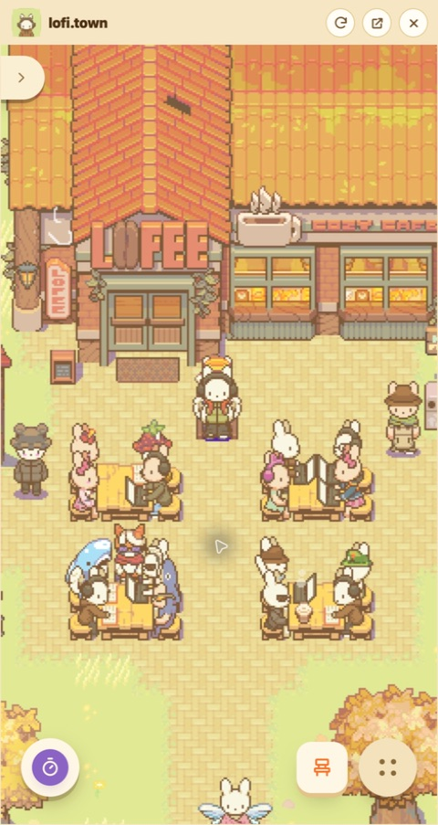
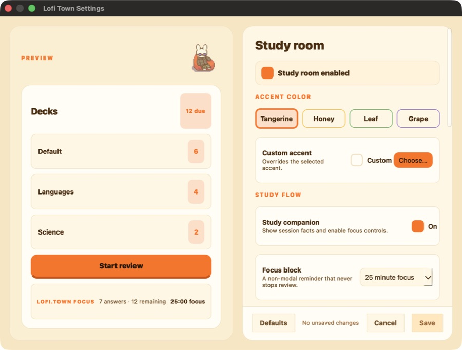

# Lofi Town for Anki

The official Lofi Town companion add-on keeps the live town beside your
flashcards in a resizable Anki panel. It also adds an optional cozy Anki theme,
focus controls, review-session facts, and Lofi Town break handoffs.

[Download the latest release](https://github.com/lofi-town/lofi-town-anki/releases/latest/download/lofi-town.ankiaddon)
or [view all releases](https://github.com/lofi-town/lofi-town-anki/releases).

<table>
  <tr>
    <td></td>
    <td></td>
  </tr>
  <tr>
    <td align="center">Live town panel</td>
    <td align="center">Optional Anki theme and study controls</td>
  </tr>
</table>

## Requirements

- Anki Desktop 25.09.5 through 26.08.1.
- macOS, Windows, or Linux.
- An internet connection for the Lofi Town panel.

AnkiMobile and AnkiDroid do not load desktop add-ons.
[Download Anki Desktop from the official Anki site](https://apps.ankiweb.net/)
if it is not already installed.

## Install

1. Download
   [`lofi-town.ankiaddon`](https://github.com/lofi-town/lofi-town-anki/releases/latest/download/lofi-town.ankiaddon)
   and its optional
   [SHA-256 checksum](https://github.com/lofi-town/lofi-town-anki/releases/latest/download/lofi-town.ankiaddon.sha256).
2. Open Anki Desktop and choose **Tools > Add-ons**.
3. Choose **Install from file**, then select `lofi-town.ankiaddon`.
4. Restart Anki when installation finishes.
5. Choose **Tools > Lofi Town** to open the panel.

### Verify the download

Each release includes `lofi-town.ankiaddon.sha256`. Download it beside the
add-on and compare the published checksum before installing.

macOS:

```sh
shasum -a 256 lofi-town.ankiaddon
```

Linux:

```sh
sha256sum lofi-town.ankiaddon
```

Windows PowerShell:

```powershell
Get-FileHash .\lofi-town.ankiaddon -Algorithm SHA256
```

## First use

- Choose **Tools > Lofi Town** to show or hide the panel.
- Drag the panel edge to resize it or drag it between the left and right sides.
- Use the title-bar pop-out button to move Lofi Town into its own window or
  dock it back into Anki.
- Choose **Tools > Lofi Town Settings...** to adjust the theme, focus block,
  reviewer controls, motion, spacing, and low-resource mode.
- Google and Discord sign-in open in the system browser and return to Anki.
  Keep Anki running until sign-in finishes.

Panel visibility, size, placement, zoom, settings, and the isolated Lofi Town
browser profile are stored locally by the add-on.

The embedded Lofi Town service uses its own account, cookie, and service data.
See [PRIVACY.md](PRIVACY.md) and the
[Lofi Town privacy policy](https://www.lofi.town/privacy-policy).

## Update

Download the newest `lofi-town.ankiaddon` and repeat the installation steps.
Anki replaces the add-on code while preserving its local settings and
`user_files` data. Restart Anki after every update.

## Remove

1. In Anki, choose **Tools > Add-ons**.
2. Select **Lofi Town** and choose **Delete**.
3. Restart Anki.

Removing the add-on does not delete or reschedule cards.
Lofi Town account data is managed separately under the
[Lofi Town privacy policy](https://www.lofi.town/privacy-policy).

## Features

- Runs the full Lofi Town app from `https://app.lofi.town` in a resizable panel
  with one-click docked and floating layouts.
- Keeps sign-in, music, game state, and browser storage isolated from normal
  browsing sessions.
- Adds customizable light and dark Anki themes with adjustable color, spacing,
  text size, roundness, motion, and texture.
- Adds optional reviewer facts, answer-key hints, quiet reviewer mode, and
  pauseable 15, 25, or 50 minute focus blocks.
- Reveals the existing Lofi Town panel after a focus block or completed deck.
- Leaves card templates and AnkiHub-owned views unchanged.

## Privacy and safety

The add-on never sends decks, cards, answers, review counts, or collection data
to Lofi Town. It never scans or writes the Anki collection. Session facts use
reviewer events and counts that Anki already displays.

The panel loads the Lofi Town web service. Its network requests and account
data are governed by the [Lofi Town privacy policy](https://www.lofi.town/privacy-policy).
Cookies, local storage, and cache files stay in the add-on's isolated local
browser profile. See [PRIVACY.md](PRIVACY.md) for the complete data boundary.

- Top-level panel navigation is restricted to `https://app.lofi.town`.
- Public HTTPS links open in the system browser.
- Local, credential-bearing, file, and custom-scheme links are rejected.
- OAuth callbacks use a random, single-use local address and expire after five
  minutes.
- Camera, microphone, location, notifications, downloads, screen capture, and
  clipboard access are disabled.
- Authorization codes are never logged or persisted by the add-on.

Report security issues privately according to [SECURITY.md](SECURITY.md).

## Troubleshooting

- **The panel is hidden:** choose **Tools > Lofi Town**.
- **The panel is blank or unavailable:** use the reload button in its title bar,
  then try the external-browser button to confirm `app.lofi.town` is reachable.
- **Browser sign-in does not return to Anki:** keep Anki open, retry once, and
  report the provider, operating system, and Anki version if it still fails.
- **Anki feels slow:** enable **Low-resource mode** in **Lofi Town Settings** and
  disable texture or the review backdrop.
- **The add-on stopped working after an Anki update:** confirm the Anki version
  is in the supported range and install the latest Lofi Town release.

For reproducible problems, [open a GitHub issue](https://github.com/lofi-town/lofi-town-anki/issues/new)
with the operating system, Anki version, add-on version, and steps to reproduce.
Do not attach card content, account details, or authorization codes.

The medical-student forum research behind the study features is documented in
[`research/med-student-anki-needs.md`](research/med-student-anki-needs.md).

## Development

Python 3.10 or newer and GNU Make are required.

```sh
make bootstrap
make help
make lint typecheck test check-package
make install-dev
```

`make install-dev` uses the standard Anki add-on directory for the current
operating system. Set `ANKI_ADDONS_DIR` to override it.

To run the Qt construction smoke test, install a supported `aqt[qt]` wheel in
`.venv`, then run `make qt-smoke`.

`make package` creates `dist/lofi-town.ankiaddon`. The archive is reproducible,
has no wrapper directory, excludes caches, and includes only the
`user_files/README.txt` placeholder from persistent storage.

See [CONTRIBUTING.md](CONTRIBUTING.md) before submitting a pull request.

## Release checklist

Before publishing a release:

1. Confirm `http://127.0.0.1:*/**` is in the Supabase authentication redirect
   allowlist.
2. Verify Google and Discord sign-in from a packaged add-on.
3. Verify the live town connection from the packaged add-on.
4. Update `RELEASE_NOTES.md` and the version in `pyproject.toml`.
5. Push a matching tag such as `v1.2.2`.

The tag workflow runs the full checks and publishes `lofi-town.ankiaddon` and
its SHA-256 checksum to GitHub Releases.

## License

The source code is licensed under the [GNU Affero General Public License,
version 3 or later](LICENSE). Copyright 2026 Lofi Town contributors.

The Bricolage Grotesque font remains under the SIL Open Font License. Lofi Town
names, logos, and mascot artwork are not licensed under the AGPL; see
[TRADEMARKS.md](TRADEMARKS.md).
